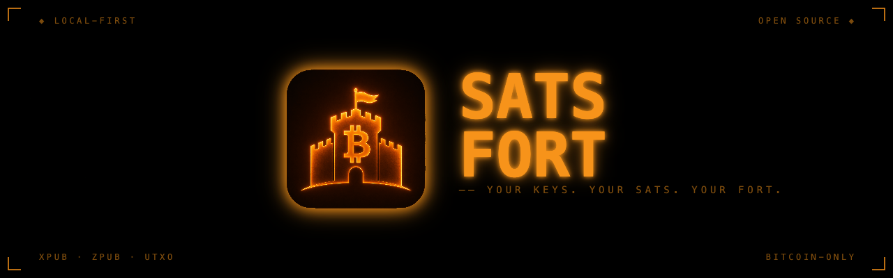
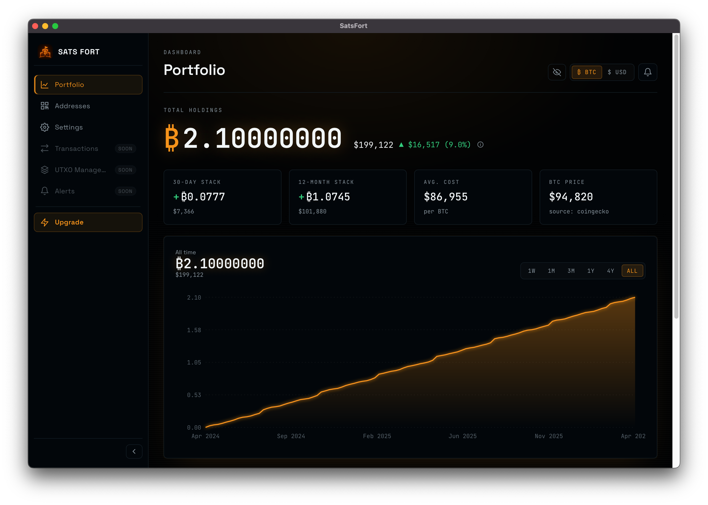
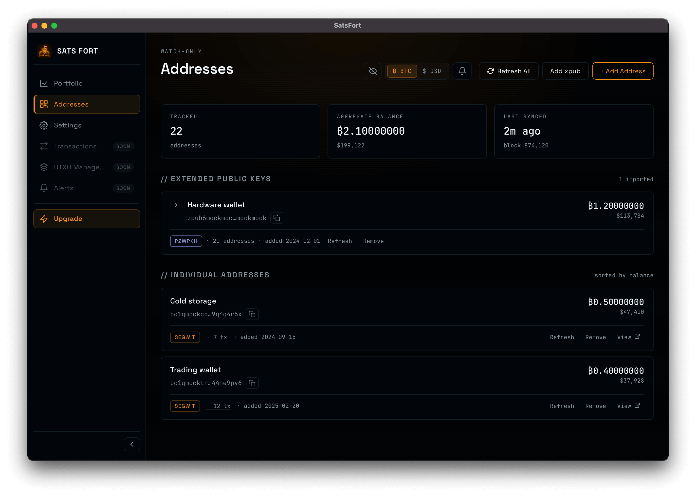
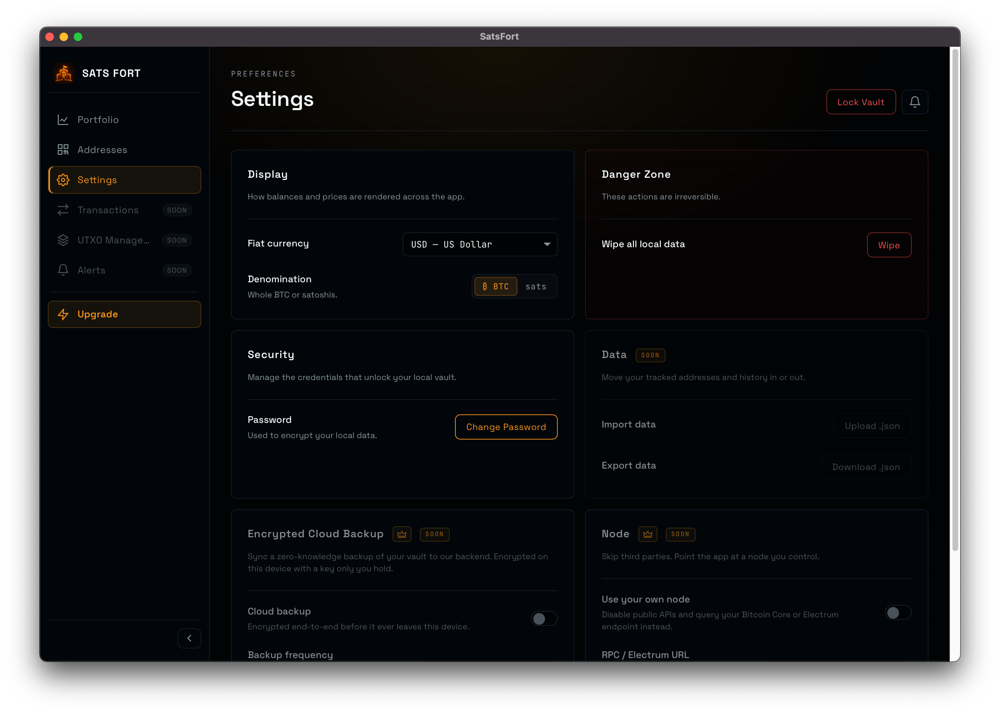

<p align="center">
  
</p>

<h1 align="center">Sats Fort</h1>
<p align="center">
  <strong>Your stack. Your business.</strong><br/>
  Bitcoin-only portfolio tracker. Local-first. Open source.
</p>

<p align="center">
  
  
  
  
</p>

---

## Screenshots

<p align="center">
  
</p>

<p align="middle">
  
  
</p>


## Why Sats Fort

Most portfolio trackers ask for your addresses, your email, and your trust. Sats Fort asks for none of that.

- **Local-first.** Your xpubs, addresses, and history live in an encrypted SQLite database on your machine. The app works fully offline, no account required.
- **Bitcoin only.** No shitcoins, no noise. Every feature is built around BTC.
- **Watch-only by design.** Sats Fort never holds private keys. Import an xpub or paste an address, and it will track balances and history without ever being able to spend.
- **Open source.** AGPLv3, audit it yourself, run it yourself, fork it if you want to.
- **Zero-knowledge backups (optional).** Premium users can sync an end-to-end encrypted backup of their vault to our backend. Encryption happens on your device with a key only you hold, so the server stores ciphertext it cannot read. (coming soon)

## Features

- Track balances across multiple xpubs and standalone addresses
- Per-address transaction history with confirmations
- Portfolio value chart with cost-basis tracking
- Privacy toggle to hide balances at a glance
- Encrypted local vault, protected by a password
- One-click "wipe local data" for fast factory reset
- Cross-platform desktop app (macOS, Windows, Linux)
- Optional end-to-end encrypted cloud backup for premium users (coming soon)

## Download

Grab the latest installer from the [Releases](../../releases) page:

- **macOS** &nbsp;`SatsFort_x.y.z_universal.dmg`
- **Windows** `SatsFort_x.y.z_x64-setup.exe` or `.msi`
- **Linux** &nbsp;&nbsp;&nbsp;`.AppImage`, `.deb`, or `.rpm`

> Builds are currently unsigned. On macOS you may need to right-click the app and choose "Open" the first time. Code signing is on the roadmap.

## Tech stack

| Layer    | Stack                                                                |
| -------- | -------------------------------------------------------------------- |
| Backend  | [Tauri 2](https://tauri.app) (Rust)                                  |
| Frontend | React 19, TypeScript, Vite                                           |
| Storage  | SQLite (with schema migrations) on the Rust side                     |
| Bitcoin  | `bitcoinjs-lib`, `bip32`, `tiny-secp256k1` for xpub derivation       |
| Tests    | Vitest (unit), WebdriverIO + tauri-driver (e2e), `cargo test` (Rust) |

## Development

### Prerequisites

- **Node.js** 22+
- **Rust** stable toolchain ([rustup.rs](https://rustup.rs))
- **Linux only**: `libwebkit2gtk-4.1-dev`, `libgtk-3-dev`, `libayatana-appindicator3-dev`, `librsvg2-dev`, `patchelf` (see [`.github/workflows/ci.yml`](.github/workflows/ci.yml) for the full list)

### Quick start

```bash
git clone git@github.com:satsfort/satsfort.git
cd satsfort
npm install
npm run tauri dev
```

The app window should open within a minute or two on the first build (Rust compiles a lot up front, subsequent runs are quick).

### Useful scripts

| Command                                           | What it does                                     |
| ------------------------------------------------- | ------------------------------------------------ |
| `npm run tauri dev`                               | Full app with hot reload                         |
| `npm test`                                        | Vitest unit tests                                |
| `npm run lint`                                    | ESLint                                           |
| `npm run format`                                  | Prettier write                                   |
| `npm run test:e2e`                                | Build a release binary and run WebdriverIO tests |
| `cargo test --manifest-path src-tauri/Cargo.toml` | Rust tests                                       |

### Building installers locally

```bash
npm run tauri build
```

Output lands in `src-tauri/target/release/bundle/`. CI builds the same artifacts for all three platforms on every tagged release, see [`.github/workflows/release.yml`](.github/workflows/release.yml).

## Project structure

```
src/              React frontend (pages, components, services)
src-tauri/        Rust backend (commands, SQLite migrations, structs)
e2e/              WebdriverIO end-to-end specs
docs/             Design notes and protocols
images/           Branding assets
```

## Contributing

Issues and PRs are welcome. For large changes, please open an issue first to discuss the approach. Run `npm run lint`, `npm test`, and `cargo test` before submitting.

## License

[AGPL-3.0](LICENSE.md). If you run a modified version of Sats Fort as a network service, you must offer the source to your users.
